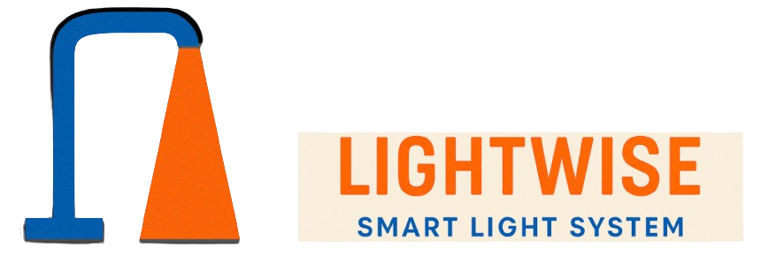

[](https://github.com/91tleg/lightwise/actions/workflows/firmware-ci.yml)
[](https://github.com/91tleg/lightwise/actions/workflows/web-ci.yml)
[](https://github.com/91tleg/lightwise/actions/workflows/web-deploy.yml)
[](https://github.com/91tleg/lightwise/actions/workflows/api-ci.yml)
[](https://github.com/91tleg/lightwise/actions/workflows/api-deploy.yml)

LightWise is a comprehensive, fault-tolerant telemetry platform designed to manage distributed, sensor-rich lighting infrastructure at scale. By bridging the gap between autonomous embedded firmware and cloud-based analytics, LightWise enables municipalities to transform standard streetlights into intelligent, self-healing edge nodes.

---

## Key Features

### Intelligent Edge Nodes

- Autonomous Operation: Each streetlight functions as a real-time embedded node capable of local decision-making.

- Fault Tolerance: Built-in logic for detecting partial or total sensor failures. The system automatically enters degraded operation modes to maintain core functionality during hardware faults.

### Robust Connectivity

- LoRaWAN Integration: Optimized for long-range, low-power communication in dense urban environments.

- Hybrid Telemetry: Supports both event-driven triggers (for immediate alerts) and periodic heartbeats (for health monitoring).

- Data Integrity: Device-side health assessments validate telemetry quality before transmission.

### Cloud & Analytics Dashboard

- Real-time Visualization: A unified web dashboard for fleet-wide monitoring and diagnostics.

- Aggregated Analytics: Backend processing converts raw sensor data into actionable insights regarding energy usage and maintenance cycles.

---

## Documentation Structure

This README provides a high-level overview only.

Detailed technical and planning documentation is maintained in the `/docs` directory:

- [System Architecture](docs/system-architecture.md): Overall platform design and data flow  
- [Database Schema](docs/database-schema.md): Data models, access patterns, and retention strategy   
- [API Contracts](docs/api-contract-v1.0.md): Telemetry ingestion and service interfaces  
- [Firmware Architecture](firmware/docs/firmware-architecture.md): ESP32 and component flow  
- [Hardware Specifications](firmware/docs/hw-spec.md): Hardware component specification  
- [Sprint Plans & Backlog](docs/sprint/): Project planning and progress tracking  
- [Contributing](CONTRIBUTING.md): Development standards  
- [License](LICENSE): Project licensing terms 

Please refer to the appropriate document for details.

---

## Repository Structure

```
LightWise/
├── .github/
│   └── workflows/    # CI/CD pipelines (firmware, frontend, lambda)
│
├── apps/
│   ├── api/          # Serverless backend (AWS Lambda functions)
│   ├── firmware/     # Embedded firmware (ESP32, device drivers, RTOS)
│   └── web/          # Web dashboard (React frontend)
│
├── docs/             # System-level documentation
├── scripts/          # Build, deployment, and automation scripts
│
├── .gitignore
├── LICENSE
├─- README.md         # Main project documentation
└── CONTRIBUTING.md   # Contributing guideline
```

## Quick Links

- [Firmware](firmware/)
- [Lambda](apps/api/)
- [Frontend](apps/web/)
- [Documentation](docs/)

## Project Setup Guide

This repository contains three main components:

- **Web UI** — React frontend  
- **Backend API** — AWS Lambda (Python)  
- **Firmware** — PlatformIO embedded firmware  

Follow the section for the component you want to run.

---

### Prerequisites

#### Common
- Git
- [Node.js](https://nodejs.org)
- [Python](https://python.org)

#### Firmware Development

Install the **PlatformIO IDE extension** for VSCode:

1. Install VSCode  
   https://code.visualstudio.com

2. Open Extensions Marketplace  
3. Search for **PlatformIO IDE**  
4. Install and reload VSCode  

---
#### React Web Application

1. Install Dependencies
```bash
    cd apps/web
    npm install
```
2. Start Development Server
```bash
    npm run dev
```
3. Production Build
```bash
    npm run build
```
#### Lambda Backend (Python)

1. Create Virtual Environment
```bash
    #Linux / MacOS
    python3 -m venv .venv
    source .venv/bin/activate

    #Windows
    python -m venv .venv
    .venv\Scripts\activate
```

2. Install dependencies
```bash
    pip install -r requirements.txt
```

---

**Version:** 1.2  
**Last Updated:** February 17, 2026