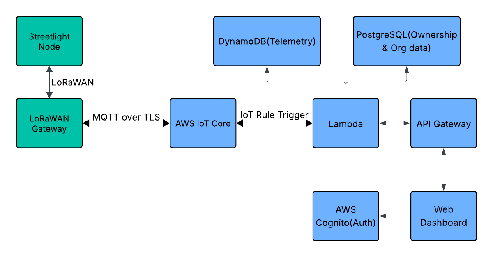

# System Architecture

## Overview

LightWise is a scalable IoT platform for smart streetlight management. The system collects real-time telemetry from distributed ESP32 nodes via LoRaWAN, processes data in AWS, and provides real-time visualization through a React dashboard.

**Architecture Diagram**:


## System Components

### 1. Edge Layer (IoT Devices)

#### ESP32 Streetlight Nodes
**Purpose**: Collect sensor data from streetlight poles  
**Responsibilities**:
- Acquire sensor readings (light, motion, temperature, humidity)
- Perform local data aggregation and filtering
- Compress and encrypt telemetry packets
- Transmit data via LoRaWAN (Class A, confirmed uplink)
- Handle low-power sleep cycles and wake events

#### LoRaWAN Gateway
**Purpose**: Bridge between streetlight nodes and cloud  
**Responsibilities**:
- Receive encrypted LoRaWAN packets from multiple nodes
- Decrypt and forward to AWS IoT Core via MQTT
- Handle message queuing and retry logic
- Monitor gateway health and connectivity

### 2. Cloud Processing Layer (AWS)

#### AWS IoT Core
**Purpose**: Managed MQTT message broker and device gateway  
**Responsibilities**:
- Accept MQTT connections from gateways with mTLS authentication
- Route messages based on topic rules
- Provide event bridge to Lambda/other services
- Manage IoT device registry and shadow state

**Configuration**:
- **Endpoint**: `<account-id>-ats.iot.<region>.amazonaws.com:8883`
- **Protocol**: MQTT 3.1.1 over TLS 1.2+
- **Topics**: `lightwise/telemetry/{poleId}`
- **Rules**: Forward all telemetry to Lambda Ingest function

#### Lambda: Telemetry Ingest
**Purpose**: Validate and store incoming telemetry data  
**Responsibilities**:
- Receive MQTT messages from IoT Core
- Validate payload schema and field ranges
- Enrich data (add processing timestamp, request ID)
- Store records in DynamoDB with optimized write patterns
- Log errors and metrics to CloudWatch

#### Lambda: Telemetry Retrieval
**Purpose**: Serve historical data to frontend dashboard  
**Responsibilities**:
- Query DynamoDB for records matching filters (poleId, timestamp range)
- Apply pagination and result limits
- Format response according to API contract
- Cache frequently accessed queries (Redis/ElastiCache optional)


#### DynamoDB (Time-Series Data)
**Purpose**: Store telemetry records with high throughput  
**Responsibilities**:
- Store all incoming sensor readings
- Provide fast queries by poleId and timestamp
- Automatically expire old records via TTL

#### API Gateway
**Purpose**: REST API frontend for dashboard and integrations  
**Responsibilities**:
- Accept HTTP requests from frontend with JWT tokens
- Validate authentication via AWS Cognito
- Route requests to Lambda functions
- Enforce rate limiting and throttling
- Log requests and responses

**Endpoints**:
- `POST /telemetry` — Ingest telemetry (auth: API Key)
- `GET /telemetry` — Retrieve historical data (auth: JWT)
- `GET /health` — System health check (no auth)

#### AWS Cognito
**Purpose**: Manage user authentication and authorization  
**Responsibilities**:
- User sign-up, sign-in, and password management
- Issue JWT tokens for authenticated requests
- Manage user attributes (organization, role, permissions)

**Configuration**:
- **User Pool**: LightWiseUsers
- **Clients**: React dashboard
- **Attributes**: email, phone, organization_id, role
- **Token Expiry**: 1 hour (access), 30 days (refresh)

#### PostgreSQL (Business Data)
**Purpose**: Store organization and user data
**Responsibilities**:
- User accounts and organizations
- Streetlight pole registry and metadata
- Alerts and rules configuration
- Usage metrics and billing data

### 3. UI Layer (Frontend)

#### React Dashboard
**Purpose**: Real-time visualization and control interface  
**Responsibilities**:
- Display live telemetry from streetlight poles
- Show historical trends and analytics
- Manage user accounts and organizations
- Configure alerts and automation rules
- Handle user authentication via Cognito

**Features**:
- Real-time data updates (REST polling, WebSocket future)
- Interactive maps showing pole locations
- Time-series charts and graphs
- Alert configuration and management
- User and organization settings

**Deployment**:
- Static site hosted on S3 + CloudFront CDN
- Client-side auth with Cognito SDK
- API calls to API Gateway with JWT tokens

---

## Data Flow Scenarios

### Scenario 1: Event-driven Telemetry (Human / Light Events)
Trigger: Sensor events (motion detected, light turned on/off, dimmed).
```
1. ESP32 Node detects an event:
   - Motion detected → Human present
   - Light turned on/off → automatic or manual control
   - Light dimmed → timer expired (no movement)
2. Node creates telemetry payload:
   - event_type (motion_on/off, light_on/off, dim)
   - timestamp
   - current brightness level
   - sensor readings (optional)
3. Node encrypts payload with LoRa credentials
4. Node sends LoRaWAN confirmed uplink to gateway
5. Gateway receives packet and confirms delivery to node
6. Gateway publishes to MQTT topic: lightwise/events/<pole_id>
7. AWS IoT Core receives MQTT message
8. IoT Rule matches topic pattern and invokes Lambda:ingest_event
9. Lambda validates schema and field ranges
10. Lambda writes record to DynamoDB
11. Record stored with TTL for automatic expiration (e.g., 30 days)
12. Lambda logs metrics to CloudWatch (event counts, latencies)
```

**Latency**: ~2-5 seconds (LoRa + MQTT + Lambda)  
**Throughput**: 1000+ msgs/sec (with auto-scaling)

### Scenario 2: Downlink Control (User Overrides / Configuration)
Downlink Control (User Overrides / Configuration)
```
1. User opens dashboard
2. User authenticates via Cognito (OAuth2 flow)
3. JWT access token issued (1-hour expiry)
4. User selects a pole or global setting:
   - Change default brightness
   - Force light level override (e.g., 100%)
5. Frontend calls API Gateway:
   - Endpoint: POST /control
   - Payload includes target pole, new setting, JWT auth
6. API Gateway validates JWT with Cognito authorizer
7. API Gateway invokes Lambda:control_node
8. Lambda:
   - Updates configuration in DynamoDB
   - Publishes downlink command to MQTT topic: lightwise/control/<pole_id>
9. ESP32 Node subscribes to control topic
10. Node receives downlink:
    - Updates local configuration
    - Applies forced brightness override if present
11. Node responds with acknowledgment to gateway
12. Lambda logs control event in CloudWatch
```

**Latency**: ~500ms-2s (authentication + query + render)  
**Typical Query**: 100-1000 records per request

---

## Scalability & Performance

### Horizontal Scalability

**IoT Devices**:
- Supports thousands of ESP32 nodes
- LoRaWAN network capacity limited by gateway (1000+ msgs/day per node)
- Scaling: Add more gateways in different coverage zones

**Cloud Processing**:
- Lambda: Auto-scales to handle concurrent requests
- DynamoDB: Provisioned throughput with auto-scaling
- API Gateway: Managed service, auto-scales transparently

**Frontend**:
- Static site (S3 + CloudFront) scales globally
- No server-side session management
- Client-side caching reduces API calls

### Performance Optimization

**Write Path** (Telemetry Ingest):
- Lambda batches writes when possible
- DynamoDB provisioned for high write throughput
- TTL reduces storage costs automatically

**Read Path** (Dashboard Queries):
- DynamoDB GSI for efficient timestamp queries
- Pagination to limit result set size
- CloudFront caches static assets
- API caching on frequently accessed data (future)

---

**Document Version**: 0.1  
**Last Updated**: January 25, 2026  