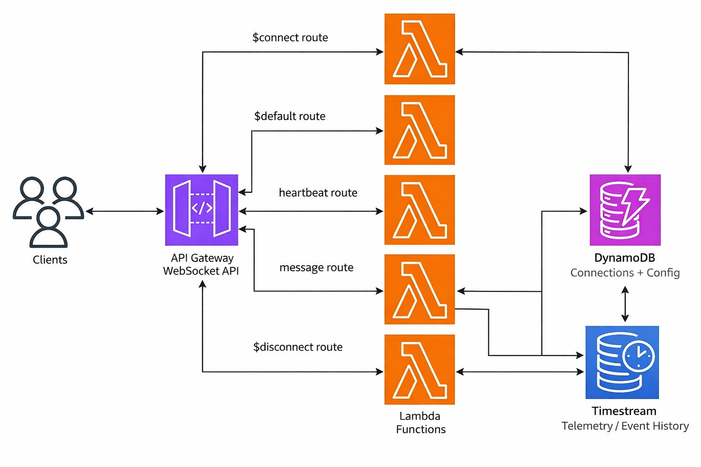

# System Architecture

**Architecture Diagram**:


---

## Architectural Principles

- Event-driven, loosely coupled services
- Clear separation between operational state and time-series data
- Serverless-first design for elasticity and cost efficiency
- Least-privilege security at every boundary
- Edge devices treated as intermittently connected and untrusted

---

## System Components

### 1. Edge Layer (IoT Devices)

#### ESP32 Streetlight Nodes
**Purpose**  
Collect environmental and operational data from individual streetlight poles.

**Responsibilities**
- Acquire sensor data (ambient light, motion, temperature, humidity)
- Perform basic local filtering and aggregation
- Encrypt telemetry using LoRaWAN security primitives
- Transmit confirmed uplinks using LoRaWAN Class A
- Handle low-power sleep, wake, and retry behavior

**Key Characteristics**
- Grid-powered
- Intermittent connectivity
- Designed to fail independently without system-wide impact

#### LoRaWAN Gateway
**Purpose**  
Bridge LoRaWAN traffic from edge devices into the cloud.

**Responsibilities**
- Receive encrypted uplinks from multiple nodes
- Forward payloads to the cloud over IP
- Handle message buffering and retry during connectivity loss
- Monitor gateway health and connectivity

---

### 2. Cloud Processing Layer

**Purpose**  
Secure device ingress and message routing layer.

#### API Gateway

**Purpose**  
Public HTTP interface for user-facing and integration APIs.

**Responsibilities**
- Terminate HTTPS requests
- Enforce authentication and authorization
- Route requests to Lambda functions
- Apply rate limiting and throttling
- Provide request logging

#### AWS IoT Core
**Purpose**: Managed MQTT message broker and device gateway  
**Responsibilities**:
- Accept MQTT connections from gateways with mTLS authentication
- Route messages based on topic rules
- Provide event bridge to Lambda/other services
- Manage IoT device registry and shadow state

#### Lambda: Telemetry Ingest
**Purpose**  
Process incoming telemetry events.

**Responsibilities**
- Receive messages from AWS IoT Core rules
- Perform basic payload validation and enrichment
- Persist time-series data
- Update latest-known device state
- Emit logs and metrics

#### Lambda: Telemetry Retrieval
**Purpose**: Serve historical data to frontend dashboard  
**Responsibilities**:
- Query DynamoDB for records matching filters (poleId, timestamp range)
- Apply pagination and result limits
- Format response according to API contract

#### AWS TimeStream (Time-Series Data)
**Purpose**: Store telemetry records with high throughput  
**Responsibilities**:
- Store all telemetry and event data
- Enable efficient time-range and device-based queries
- Enforce data retention and TTL policies

#### API Gateway
**Purpose**: REST API frontend for dashboard and integrations  
**Responsibilities**:
- Accept HTTP requests from frontend with JWT tokens
- Validate authentication via AWS Cognito
- Route requests to Lambda functions
- Enforce rate limiting and throttling
- Log requests and responses

#### AWS Cognito
**Purpose**: Manage user authentication and authorization  
**Responsibilities**:
- User sign-up, sign-in, and password management
- Issue JWT tokens for authenticated requests
- Manage user attributes (organization, role, permissions)

**Configuration**:
- **User Pool**: LightWiseUsers
- **Clients**: React dashboard
- **Attributes**: email, phone, organization_id, role
- **Token Expiry**: 1 hour (access), 30 days (refresh)

#### DynamoDB (Business Data)
**Purpose**: Store organization and user data
**Responsibilities**:
- User accounts and organizations
- Streetlight pole registry and metadata
- Alerts and rules configuration

---

### 3. UI Layer (Frontend)

#### React Dashboard
**Purpose**: Real-time visualization and control interface for operators and administrators.
**Responsibilities**
- Display live and historical telemetry
- Visualize pole locations and status
- Manage users, organizations, and permissions
- Configure alerts and automation rules
- Issue control commands to devices

**Features**:
- Real-time data updates (REST polling, WebSocket future)
- Interactive maps showing pole locations
- Time-series charts and graphs
- Alert configuration and management
- User and organization settings

**Deployment**:
- Static site hosted on S3 + CloudFront CDN
- Client-side auth with Cognito SDK
- API calls to API Gateway with JWT tokens

---

## Data Flow Scenarios

### Scenario 1: Event-driven Telemetry (Human / Light Events)
Trigger: Sensor events (motion detected, light turned on/off, dimmed).
```
1. ESP32 Node detects an event:
   - Motion detected → Human present
   - Light turned on/off → automatic or manual control
   - Light dimmed → timer expired (no movement)
2. Node creates telemetry payload:
   - event_type (motion_on/off, light_on/off, dim)
   - timestamp
   - current brightness level
   - sensor readings (optional)
3. Node encrypts payload with LoRa credentials
4. Node sends LoRaWAN confirmed uplink to gateway
5. Gateway receives packet and confirms delivery to node
6. Gateway publishes to MQTT topic: lightwise/events/<pole_id>
7. AWS IoT Core receives MQTT message
8. IoT Rule matches topic pattern and invokes Lambda:ingest_event
9. Lambda validates schema and field ranges
10. Lambda writes record to DynamoDB
11. Record stored with TTL for automatic expiration (e.g., 30 days)
12. Lambda logs metrics to CloudWatch (event counts, latencies)
```

**Latency**: ~2-5 seconds (LoRa + MQTT + Lambda)  
**Throughput**: 1000+ msgs/sec (with auto-scaling)

### Scenario 2: Downlink Control (User Overrides / Configuration)
Downlink Control (User Overrides / Configuration)
```
1. User opens dashboard
2. User authenticates via Cognito (OAuth2 flow)
3. JWT access token issued (1-hour expiry)
4. User selects a pole or global setting:
   - Change default brightness
   - Force light level override (e.g., 100%)
5. Frontend calls API Gateway:
   - Endpoint: POST /control
   - Payload includes target pole, new setting, JWT auth
6. API Gateway validates JWT with Cognito authorizer
7. API Gateway invokes Lambda:control_node
8. Lambda:
   - Updates configuration in DynamoDB
   - Publishes downlink command to MQTT topic: lightwise/control/<pole_id>
9. ESP32 Node subscribes to control topic
10. Node receives downlink:
    - Updates local configuration
    - Applies forced brightness override if present
11. Node responds with acknowledgment to gateway
12. Lambda logs control event in CloudWatch
```

**Latency**: ~500ms-2s (authentication + query + render)  
**Typical Query**: 100-1000 records per request

---

## Scalability & Performance

### Horizontal Scalability

**IoT Devices**:
- Thousands of devices supported per deployment
- Stateless compute via Lambda enables elastic scaling
- Failure of individual devices or gateways does not impact system availability
- Data retention and TTL prevent unbounded storage growth

**Cloud Processing**:
- Lambda: Auto-scales to handle concurrent requests
- DynamoDB: Provisioned throughput with auto-scaling
- API Gateway: Managed service, auto-scales transparently

**Frontend**:
- Static site (S3 + CloudFront) scales globally
- No server-side session management
- Client-side caching reduces API calls

---

**Document Version**: 2.0  
**Last Updated**: February 17, 2026  