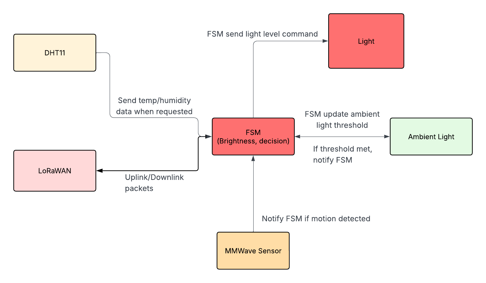

# Firmware Architecture

## Modules:

### FSM
Role:
- Manage internal states: `IDLE`, `MOTION_DETECTED`, `NIGHT_MODE`, `ERROR`, etc.
- Updates state machine based on events.
- Store configurations: dimming schedules, thresholds, timers.

Considerations:
- Should not block: need fast updates.
- Use event queue or flags to notify FSM of motion, timer, or LoRaWAN events.
- High priority

---

### MMWave
Role:
- Read frames, parse data, push events to FSM

Considerations: 
- Do not let MMWave task directly control lights or LoRaWAN.

---

### LoRaWAN
Role:
- Handle sending and receiving packets.

Considerations:
- LoRaWAN is usually blocking for TX/RX, or uses internal callbacks.
- Use a queue or ring buffer to push messages from FSM/diag to LoRa task.
- Ensure LoRaWAN TX does not block motion/light tasks.

---

### Ambient Light
Role:
- Read ambiet light level periodically.
- Notify FSM to turn ON/OFF light when threshold met.

---

### Light Control
Role:
- Control dimming / ON/OFF based on FSM and sensor input.
- Subscribe to event from FSM 

Considerations:
- Must react fast to motion for safety/lighting.
- High-priority.

---

### DHT11
Role:
- Called when motion is detected, for extra data to send uplink.
- Hangs until motion is detected.

Considerations: 
- DHT11 is slow and blocking.
- Low-priority.

## Event Flow Example:

- MMWave task reads frames → detects motion → posts MOTION_DETECTED to FSM queue.

- FSM task updates state → posts event to Light Control (TURN_ON, DIM_LEVEL).

- FSM task request DHT11 data → send to LoRaWAN task to send uplink.

- LoRaWAN task asynchronously sends telemetry.

---

**Document Version**: 1.0  
**Last Updated**: January 29, 2026  
