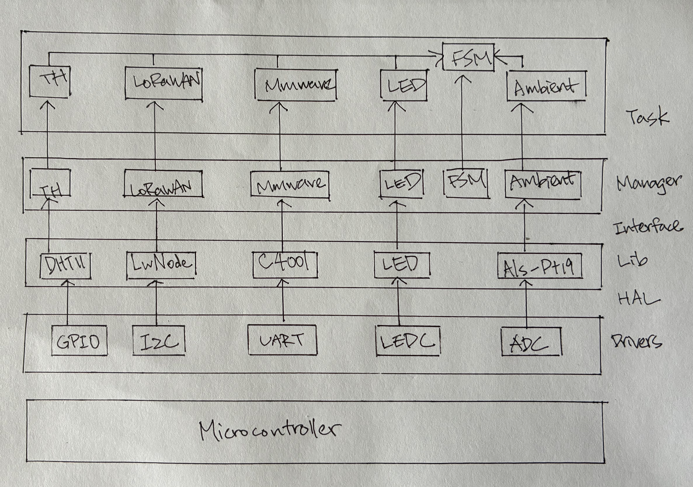
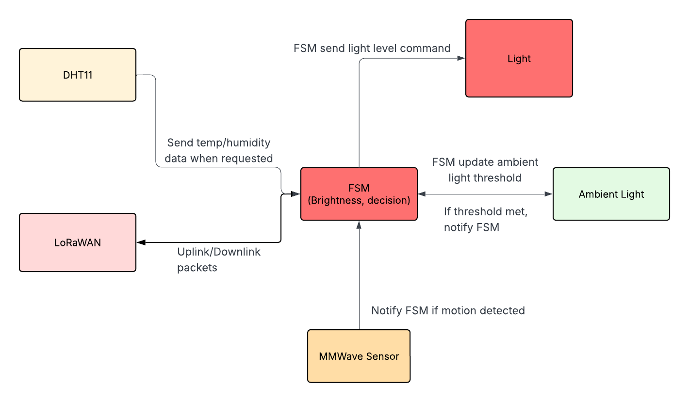

# Firmware Architecture

Lightwise firmware uses a layered architecture. 

## RTOS Tasks

### FSM
Role:
- Manage internal states: `IDLE`, `MOTION_DETECTED`, `NIGHT_MODE`, `ERROR`, etc.
- Updates state machine based on events.
- Store configurations: dimming schedules, thresholds, timers.

Considerations:
- Should not block: need fast updates.
- Use event queue or flags to notify FSM of motion, timer, or LoRaWAN events.
- High priority

---

### MMWave
Role:
- Read frames, parse data, push events to FSM when motion detected.

---

### LoRaWAN
Role:
- Handle sending LoRaWAN packets.

---

### Ambient
Role:
- Read ambiet light level periodically.
- Notify FSM to turn ON/OFF light when threshold met.

---

### LED
Role:
- Control dimming / ON/OFF based on FSM and sensor input.
- Subscribe to event from FSM 

Considerations:
- Must react fast to motion for safety/lighting.
- High-priority.

---

### TH
Role:
- Called when motion is detected, for temperature/humidity data to send uplink.
- Idles until motion is detected.

Considerations: 
- DHT11 is slow and blocking.
- Low-priority.

## Event Flow Example:

- MMWave task reads frames → detects motion → posts event to FSM queue.

- FSM task updates state → posts light level to Light.

- FSM task request temperature/humidity data → send to LoRaWAN task to send uplink.

- LoRaWAN task asynchronously sends telemetry uplink.

---

**Document Version**: 1.1  
**Last Updated**: Feb 26, 2026  
